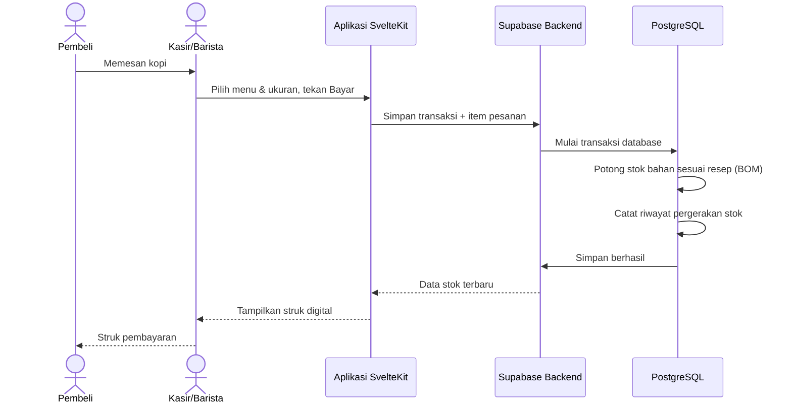
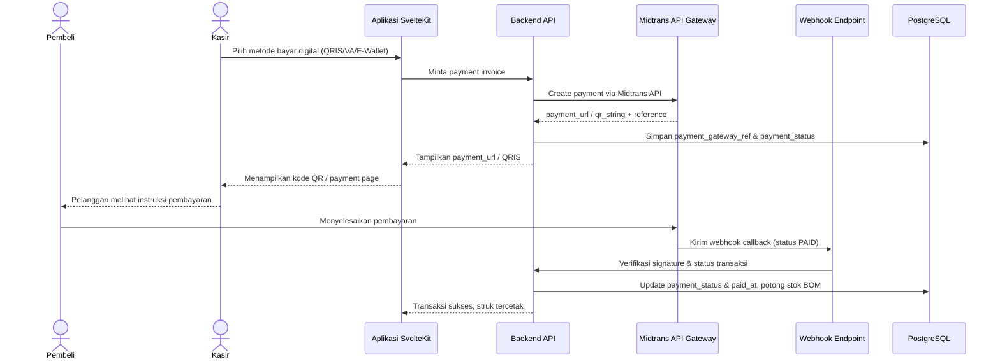
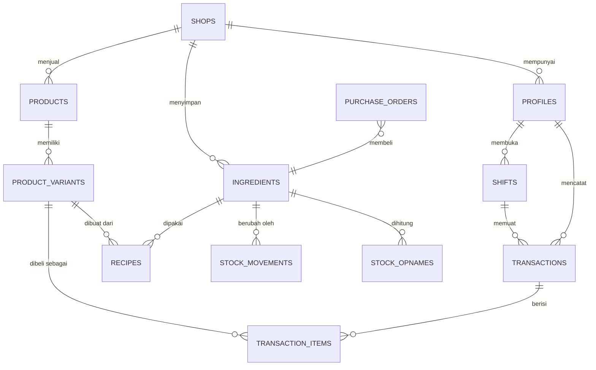

# PRD — Project Requirements Document

## 1. Overview

UMKM coffee shop sering menghadapi masalah stok bahan baku yang tidak akurat. Pemilik harus melakukan stock opname manual setiap malam, padahal selisih bisa terjadi karena human error, tumpah, atau takaran yang tidak konsisten. Akibatnya, bahan seperti biji kopi, susu, dan sirup bisa habis mendadak di jam sibuk.

Visi produk ini adalah menyediakan sistem POS (Point of Sale) yang sederhana namun kuat, dengan stok gudang yang terintegrasi real-time. Setiap penjualan yang terjadi di kasir akan otomatis mengurangi bahan baku berdasarkan resep (BOM/Bill of Materials), sehingga pemilik selalu tahu persis sisa stok dan HPP (Harga Pokok Penjualan).

Nilai tambah utama:
- Stok berkurang otomatis tanpa hitung manual.
- Pencegahan selisih data, kehilangan, dan potensi fraud.
- Peringatan saat stok menipis agar tidak kehabisan bahan.
- Laporan penjualan, HPP, dan laba dapat dilihat kapan saja.

## 2. Requirements

### 2.1 Persona Pengguna

1. **Rina (24) — Kasir/Barista**  
   Butuh mencatat pesanan dengan cepat, menerima pembayaran, dan memastikan stok tidak perlu dihitung manual. Saat shift selesai, ia ingin menutup kas dengan mudah.

2. **Budi (28) — Pemilik/Manajer Toko**  
   Ingin memantau stok bahan baku secara real-time, mengetahui menu yang paling menguntungkan, dan memastikan tidak ada kehilangan stok. Ia juga ingin melihat laporan penjualan dan HPP tanpa harus membuka spreadsheet.

3. **Sari (30) — Admin Gudang**  
   Bertanggung jawab menerima pembelian bahan, mencatat stok masuk, melakukan stock opname, dan menyetujui selisih. Ia membutuhkan data stok yang akurat untuk mengambil keputusan pembelian.

### 2.2 User Stories

- Sebagai **Kasir**, saya ingin mencatat pesanan dalam beberapa klik agar antrean pelanggan cepat selesai.
- Sebagai **Kasir**, saya ingin memilih metode pembayaran dengan hitung kembalian otomatis agar tidak salah hitung.
- Sebagai **Kasir**, saya ingin membuka dan menutup shift dengan rekap kas agar saldo kas sesuai.
- Sebagai **Admin Gudang**, saya ingin melihat stok bahan baku secara real-time agar tahu bahan mana yang harus segera dibeli.
- Sebagai **Admin Gudang**, saya ingin mendapat peringatan saat stok menipis agar tidak kehabisan di jam sibuk.
- Sebagai **Admin Gudang**, saya ingin melakukan stock opname dan menyetujui selisih agar data fisik sesuai dengan sistem.
- Sebagai **Pemilik**, saya ingin melihat laporan HPP dan laba per menu agar tahu menu yang paling menguntungkan.
- Sebagai **Pemilik**, saya ingin melihat riwayat pergerakan stok dan penjualan agar bisa mendeteksi kehilangan atau kejanggalan.

### 2.3 Persyaratan Fungsional

**Modul POS / Kasir**
- Mencatat pesanan dengan cepat, termasuk pilihan varian menu (reguler/besar).
- Menampilkan total pesanan secara real-time.
- Mendukung pembayaran tunai, QRIS, dan kartu debit dengan hitung kembalian otomatis.
- Mengintegrasikan Midtrans API untuk pembayaran digital (QRIS dinamis, Virtual Account, E-Wallet, dan kartu kredit), termasuk membuat payment invoice/Snap, memverifikasi status transaksi secara otomatis melalui webhook notifikasi, dan menyimpan payment gateway reference ID.
- Menampilkan rincian pesanan dan mencetak/mengirim struk.
- Membuka shift dengan saldo awal dan menutup shift dengan rekap kas.

**Modul Inventaris & Resep**
- Mengelola daftar bahan baku beserta satuan (gram, ml, pcs).
- Menyusun resep/BOM, misalnya 1 Es Kopi Susu = 15g biji kopi + 150ml susu segar + 20ml sirup aren + 1 set cup.
- Saat transaksi selesai, stok bahan baku dipotong otomatis sesuai BOM.
- Mencatat semua pergerakan stok: masuk, keluar, penyesuaian, dan sisa.
- Menyediakan fitur stock opname dan koreksi selisih dengan alasan.
- Memberikan notifikasi low stock saat stok mencapai batas minimum.

**Modul Laporan**
- Dashboard ringkasan penjualan: omzet, jumlah transaksi, menu terlaris.
- Perhitungan HPP otomatis dari resep sehingga laba kotor terlihat jelas.
- Ekspor laporan penjualan dan stok dalam format file.

### 2.4 Persyaratan Non-Fungsional

- **Kecepatan sinkronisasi:** Perubahan stok harus tampil di semua perangkat dalam waktu kurang dari 2 detik.
- **Keamanan data:** Login dengan email dan kata sandi, pengaturan hak akses berdasarkan peran, serta keamanan data di tingkat database (Row Level Security).
- **Keandalan:** Jika koneksi internet terputus, aplikasi harus tetap bisa menerima transaksi (offline mode) dan menyinkronkan data saat koneksi pulih tanpa menggandakan potongan stok.
- **Kejelasan audit:** Semua perubahan stok harus memiliki riwayat dan alasan yang dapat ditelusuri.

### 2.5 Success Metrics (KPI)

- Akurasi stok fisik vs sistem mencapai ≥ 98%.
- Waktu rata-rata proses transaksi ≤ 60 detik per pesanan.
- Kejadian stok habis di tengah jam sibuk turun ≥ 50% dalam 3 bulan.
- Waktu stock opname malam hari turun menjadi ≤ 15 menit.
- 80% transaksi harian dicatat melalui sistem POS pada bulan pertama adopsi.
- Laporan HPP dan laba dapat dihasilkan dalam satu klik tanpa perhitungan manual.

## 3. Core Features

### Fase 1 — Kasir Cepat
- **Kasir Cepat** *(prioritas tinggi)*
  - **Catat Pesanan** — Pilih menu dan jumlah, lalu total pesanan langsung terlihat.
  - **Pilih Metode Bayar** — Dukung tunai, QRIS, dan kartu debit dengan hitung kembalian otomatis; untuk pembayaran digital non-tunai, terhubung ke Midtrans API.
  - **Bayar Digital dengan Midtrans** — Generate payment invoice / QRIS (QRIS dinamis, Virtual Account, E-Wallet), cek status transaksi melalui webhook notifikasi dan polling, serta catat payment gateway reference ID.
  - **Rincian & Struk** — Tampilkan rincian pesanan dan buat struk untuk dicetak atau dikirim.
  - **Buka Tutup Shift** — Buka shift dengan saldo awal dan tutup dengan rekap kas.

### Fase 2 — Atur Menu & Resep
- **Atur Menu & Resep** *(prioritas tinggi)*
  - **Daftar Menu** — Tambah atau ubah menu kopi dan non-kopi beserta harga.
  - **Susun Resep** — Tentukan setiap bahan baku dan takarannya untuk satu porsi menu.
  - **Kelola Bahan Baku** — Tambahkan bahan seperti biji kopi, susu, dan sirup beserta satuannya.
  - **Variasi Ukuran** — Atur ukuran reguler dan besar dengan resep serta harga berbeda.

### Stok Real-time
- **Stok Real-time** *(prioritas tinggi)*
  - **Potong Stok Otomatis** — Setiap penjualan langsung mengurangi bahan baku sesuai resep.
  - **Pantau Stok Langsung** — Lihat sisa stok terkini setiap bahan baku secara real-time.
  - **Peringatan Stok Menipis** — Muncul notifikasi saat stok mendekati batas minimum.
  - **Riwayat Pergerakan** — Telusuri semua stok masuk dan keluar lengkap dengan penyebabnya.

### Fase 3 — Stok Masuk & Opname
- **Stok Masuk & Opname** *(prioritas sedang)*
  - **Catat Pembelian** — Tambah stok dari pemasok dengan jumlah, harga, dan tanggal kedatangan.
  - **Hitung Fisik** — Masukkan hasil hitung stok aktual untuk dibandingkan dengan sistem.
  - **Koreksi Selisih** — Setujui perbedaan stok fisik lalu sistem menyesuaikan dengan catatan alasan.

### Laporan & Keuangan
- **Laporan & Keuangan** *(prioritas sedang)*
  - **Ringkasan Penjualan** — Lihat omzet, jumlah transaksi, dan menu terlaris dalam periode tertentu.
  - **Hitung HPP & Laba** — HPP dihitung otomatis dari resep sehingga laba kotor terlihat jelas.
  - **Ekspor Laporan** — Unduh laporan penjualan dan stok untuk dibagikan atau diarsipkan.

### Fase 4 — Akun & Pengaturan
- **Akun & Pengaturan** *(prioritas rendah)*
  - **Masuk ke Aplikasi** — Login dengan email dan kata sandi.
  - **Atur Hak Akses** — Tentukan peran kasir, admin gudang, dan pemilik.
  - **Profil Toko** — Atur nama toko, alamat, dan mata uang yang dipakai di struk.

## 4. User Flow

1. Pelanggan datang dan memesan, misalnya 1 Es Kopi Susu ukuran Reguler.
2. Kasir membuka aplikasi POS dan memilih menu **Es Kopi Susu** serta ukurannya.
3. Sistem menampilkan rincian pesanan dan total harga otomatis.
4. Pelanggan memilih metode pembayaran (tunai, QRIS, atau kartu debit).
5. Kasir menekan tombol **Bayar**.
6. Sistem membuat transaksi dan mencatat item penjualan.
7. Di dalam sistem, stok bahan baku gudang/toko langsung dipotong sesuai resep:
   - 15g biji kopi
   - 150ml susu segar
   - 20ml sirup aren
   - 1 set cup (gelas + tutup)
8. Sistem mencatat riwayat pergerakan stok sebagai “terjual”.
9. Jika stok bahan mencapai batas minimum, sistem memunculkan notifikasi **low stock**.
10. Kasir memberikan struk kepada pelanggan, dan dashboard stok di semua perangkat langsung terbarui.

Jika koneksi internet terputus, transaksi tetap dicatat di perangkat kasir dan disinkronkan otomatis saat internet kembali tersedia.

## 5. Architecture

Arsitektur aplikasi menggunakan **frontend terpisah dari backend**. Aplikasi dibuat dengan **SvelteKit**, di-deploy di **VPS**, dan berkomunikasi dengan **Supabase** sebagai backend. Semua data disimpan di **PostgreSQL** yang dikelola Supabase.

Alur utama:  
- Frontend SvelteKit menampilkan layar kasir, menu, stok, dan laporan.  
- Supabase menangani autentikasi, database, realtime sync, dan penyimpanan file.  
- Saat transaksi terjadi, Supabase memproses penyimpanan transaksi dan pemotongan stok secara otomatis menggunakan resep/BOM.  
- Supabase Realtime mengirimkan update stok ke semua perangkat yang sedang online.  
- Pembayaran digital diproses melalui **Midtrans API Gateway**: backend membuat payment invoice/Snap ke Midtrans, menampilkan payment URL/QRIS, dan menerima webhook notifikasi untuk verifikasi status transaksi otomatis.

Proses potong stok diletakkan di sisi backend agar berjalan secara atomik — artinya jika transaksi berhasil, stok langsung berkurang; jika gagal, tidak ada stok yang terpotong. Saat offline, aplikasi menyimpan transaksi dalam antrian lokal dan mengirimkannya saat koneksi pulih. Setiap transaksi diberi identitas unik agar tidak terjadi potongan stok dua kali.

Untuk pembayaran digital, aplikasi terhubung ke **Midtrans API Gateway**. Backend menyediakan **endpoint handler** untuk menerima **webhook notifikasi** dari Midtrans. Saat kasir memilih metode pembayaran QRIS, Virtual Account, atau E-Wallet, backend memanggil Midtrans API (Snap/charge) untuk membuat payment invoice dan mendapatkan `payment_url` / `qr_string`. Status pembayaran diverifikasi melalui webhook notifikasi yang masuk; endpoint handler memvalidasi signature, mencocokkan reference ID (order id), mengubah status transaksi, dan memicu pemotongan stok sesuai BOM. Jika notifikasi tertunda, aplikasi melakukan **polling status** ke Midtrans sebagai cadangan agar transaksi tetap sinkron.

Pembangunan sistem mengikuti fase roadmap: dimulai dari **Kasir Cepat**, lalu **Atur Menu & Resep** dan **Stok Real-time**, kemudian **Stok Masuk & Opname** dan **Laporan**, serta diakhiri **Akun & Pengaturan**.

## 6. Database Schema

Tabel-tabel utama yang dibutuhkan:

- **`shops`** — `id` (uuid, primary key), `name` (text), `address` (text), `currency` (text). Menyimpan data toko.
- **`profiles`** — `id` (uuid, primary key, merujuk ke auth user), `shop_id` (uuid, foreign key), `full_name` (text), `role` (enum: kasir/admin_gudang/pemilik). Menyimpan pengguna dan perannya.
- **`products`** — `id` (uuid, primary key), `shop_id` (uuid), `name` (text), `category` (text), `is_active` (boolean). Daftar menu.
- **`product_variants`** — `id` (uuid, primary key), `product_id` (uuid, foreign key), `name` (text, misal: Reguler/Besar), `price` (numeric), `is_active` (boolean). Varian ukuran menu.
- **`ingredients`** — `id` (uuid, primary key), `shop_id` (uuid), `name` (text), `unit` (text: gram/ml/pcs), `stock_quantity` (numeric), `min_stock` (numeric). Bahan baku dan stok saat ini.
- **`recipes`** — `id` (uuid, primary key), `variant_id` (uuid, foreign key), `ingredient_id` (uuid, foreign key), `quantity_required` (numeric). Resep/BOM setiap varian menu.
- **`shifts`** — `id` (uuid, primary key), `profile_id` (uuid, foreign key), `opened_at` (timestamp), `closed_at` (timestamp), `opening_cash` (numeric), `expected_cash` (numeric), `actual_cash` (numeric), `status` (text). Shift kasir.
- **`transactions`** — `id` (uuid, primary key), `shop_id` (uuid), `shift_id` (uuid, foreign key), `profile_id` (uuid, foreign key), `receipt_no` (text), `total_amount` (numeric), `payment_method` (text), `payment_channel` (text), `payment_gateway_ref` (text), `payment_ref` (text), `payment_status` (text), `payment_url` (text), `qr_string` (text), `cash_received` (numeric), `change_amount` (numeric), `paid_at` (timestamp), `status` (text), `created_at` (timestamp). Data transaksi penjualan; `payment_ref` menyimpan referensi gateway (Midtrans) saat transaksi menggunakan metode pembayaran digital.
- **`transaction_items`** — `id` (uuid, primary key), `transaction_id` (uuid, foreign key), `variant_id` (uuid, foreign key), `product_name` (text), `quantity` (integer), `unit_price` (numeric), `line_total` (numeric). Rincian item pesanan.
- **`stock_movements`** — `id` (uuid, primary key), `ingredient_id` (uuid, foreign key), `quantity_change` (numeric, positif masuk/negatif keluar), `movement_type` (text: sale/purchase/adjustment/waste/opname), `reference_id` (uuid), `note` (text), `created_at` (timestamp). Riwayat semua pergerakan stok.
- **`purchase_orders`** — `id` (uuid, primary key), `shop_id` (uuid), `ingredient_id` (uuid, foreign key), `supplier` (text), `quantity` (numeric), `unit_price` (numeric), `received_at` (timestamp). Pembelian stok dari pemasok.
- **`stock_opnames`** — `id` (uuid, primary key), `ingredient_id` (uuid, foreign key), `system_quantity` (numeric), `actual_quantity` (numeric), `difference` (numeric), `reason` (text), `status` (text: draft/approved), `approved_by` (uuid, foreign key), `created_at` (timestamp). Data perhitungan stok fisik dan koreksinya.

## 7. Tech Stack

Rekomendasi teknologi berdasarkan kebutuhan proyek:

- **Frontend:** SvelteKit + TypeScript  
- **Backend & Database:** Supabase  
  - PostgreSQL sebagai database utama  
  - Supabase Auth untuk login dan manajemen peran  
  - Supabase Realtime untuk sinkronisasi stok antar perangkat  
  - Supabase Storage untuk penyimpanan file, seperti bukti struk atau laporan  
  - Supabase Edge Functions untuk kebutuhan logika backend lanjutan  
- **UI Styling:** Tailwind CSS (direkomendasikan) agar pengembangan tampilan kasir cepat dan konsisten  
- **Deployment:** VPS dengan Node.js server dan reverse proxy Nginx untuk menjalankan aplikasi SvelteKit  
- **Keamanan:** Supabase Row Level Security untuk membatasi akses data berdasarkan peran pengguna
- **Third-party Services / Integrations:** **Midtrans Payment Gateway API** — menggunakan API Midtrans (Snap + charge QRIS) untuk pembayaran digital QRIS dinamis, Virtual Account, E-Wallet, dan kartu kredit, serta webhook notifikasi untuk verifikasi status transaksi otomatis.

Tech stack ini dipilih karena SvelteKit ringan dan cepat untuk aplikasi kasir, sementara Supabase sudah menyediakan database, autentikasi, dan realtime dalam satu platform sehingga pengembangan POS dapat berjalan lebih cepat dan mudah dirawat. Integrasi Midtrans menambah dukungan pembayaran digital yang lengkap dan sesuai kebutuhan pelanggan coffee shop modern.